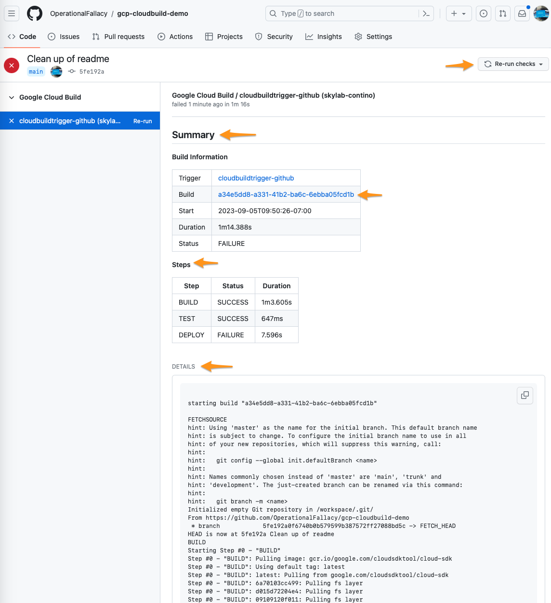

# GCP Cloud Build with Config Connector

Welcome to our demo project! Here, we showcase how to craft a build configuration for Cloud Build using the Infrastructure-as-Code (IaC) approach. We leveraged the Config Connector to create and manage Cloud Build, bringing an element of ease and automation into the process.

For utmost flexibility in both building and deploying software, we have delineated the configurations for infrastructure (`cloudbuild-github.yaml`) and the build (`src/cloudbuild.yaml`). Cloud Build will automatically utilize this build configuration whenever users initiate builds.

## Prerequisites

To get started, ensure you have the following tools installed:

- gcloud CLI
- kubectl CLI

## Resources import

`yarn cdk8s import src/config-connector.json -- output src -l typescript --check-upgrade.false`

## Create Configuration

Begin by setting up a connection with your GitHub repository so that the Cloud Build trigger can reference it. Note that this is a manual step, as users may need to authenticate access to their repository through the standard OAuth flow.

To configure gcloud:

`gcloud config set project project-name`

Next, apply the following command to initiate Cloud Build resources (the trigger):

`kubectl apply -f cloudbuild-github.yaml`

Now, simply push your commits, and Cloud Build will execute them promptly.

## Notable Features

This configuration stands out due to its completely serverless nature, managed entirely through code.

Additionally, deployments are a breeze, not requiring any credentials as all permissions can be designated to a custom service account we set up for Cloud Build.

Moreover, Cloud Build offers seamless integration with GitHub, providing live updates on build logs, build status, and build completion directly on the commits (screenshots below).

## TODO

Moving forward, we aim to configure pull request triggers and explore the variety of status updates Cloud Build can post.
